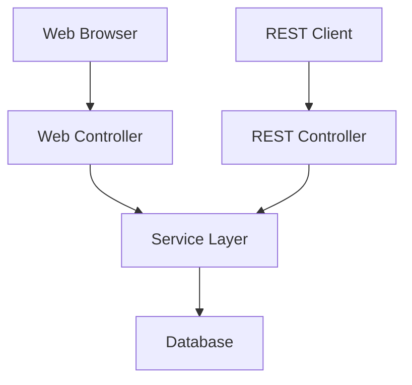
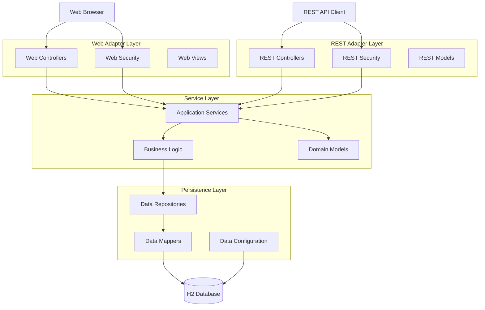
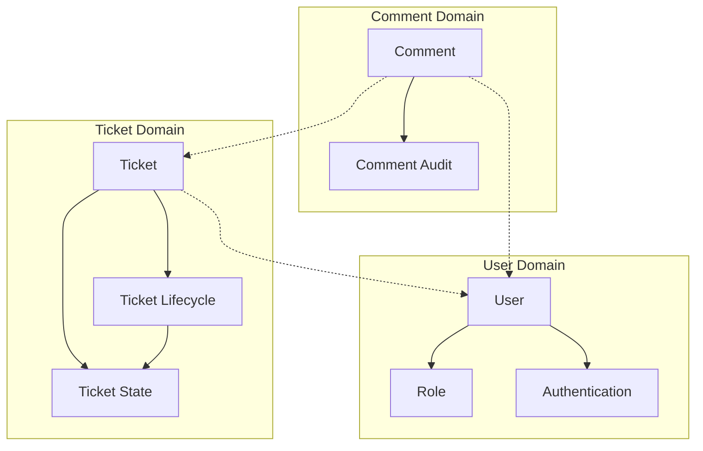

# TicketZ Architecture Documentation

## Component Architecture

The following diagram shows the component-level architecture of the TicketZ application, illustrating the hexagonal architecture pattern with clear separation between adapters and business logic.

### Strcuture Overview

### Full Component Architecture

## Architecture Overview

TicketZ follows the **Hexagonal Architecture (Ports & Adapters)** pattern with the following key characteristics:

### Core Principles

- **Domain-Driven Design**: Business logic is isolated in the service layer
- **Dependency Inversion**: All dependencies point inward toward the core
- **Port & Adapter Pattern**: Clean interfaces between layers
- **Separation of Concerns**: Clear boundaries between technical and business concerns

### Key Components

#### 1. **Adapter Layers (Outside)**

- **Web Adapter**: Server-side rendered interface using Thymeleaf templates
- **REST Adapter**: RESTful API with JWT authentication
- **Persistence Adapter**: JPA-based data access layer

#### 2. **Service Layer (Core)**

- **Business Logic**: Domain rules and workflows
- **Port Interfaces**: Contracts for external dependencies
- **Cross-Cutting Concerns**: Security, validation, transactions

#### 3. **Infrastructure**

- **Database**: H2 in-memory database
- **Security**: Dual authentication (sessions + JWT)
- **Configuration**: Spring Boot auto-configuration

### Architectural Patterns Used

- Hexagonal Architecture
- Repository Pattern
- Dependency Injection
- Model-View-Controller (MVC)
- Data Transfer Objects (DTOs)

## Business Domain Verticals

While the component architecture abstracts from specific business concerns, the TicketZ application implements three main business verticals that represent the core domain concepts:

### Domain Model Dependencies

### Business Vertical Analysis

#### **User Domain**

- **Core Entity**: `User` with email-based identification
- **Security Model**: Role-based access control (RBAC)
- **Authentication**: Dual strategy (sessions for web, JWT for API)
- **Business Rules**:
  - Unique email addresses
  - Password complexity requirements
  - Role assignment policies

#### **Ticket Domain**

- **Core Entity**: `Ticket` with unique ticket numbers
- **State Management**: Controlled state transitions via `TicketState` enum
- **Lifecycle**: Creation → In Progress → Resolution (Fixed/Rejected)
- **Business Rules**:
  - Ticket numbers are system-generated and immutable
  - State transitions follow defined workflows
  - Version control for optimistic locking
  - Author assignment is mandatory, editor is optional

#### **Comment Domain**

- **Core Entity**: `Comment` as immutable audit records
- **Associations**: Belongs to exactly one ticket and one user
- **Temporal Ordering**: Comments maintain chronological sequence
- **Business Rules**:
  - Comments cannot be modified once created (immutable)
  - Author identification is mandatory
  - Ticket association is required

### Cross-Domain Interactions

1. **User ↔ Ticket**: Users create and edit tickets, establishing ownership and responsibility
2. **User ↔ Comment**: Users author comments, providing attribution and accountability  
3. **Ticket ↔ Comment**: Comments provide detailed history and communication trail for tickets
4. **Security Integration**: All domains participate in authorization decisions based on user roles

## Notes

- The component architecture diagram shows technical structure abstracted from business domains
- The business domain diagram shows logical relationships between core entities
- Dotted lines represent entity relationships
- Color coding indicates different architectural layers
- Both web and REST interfaces coexist with different authentication strategies
